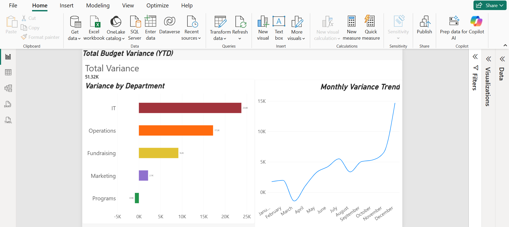
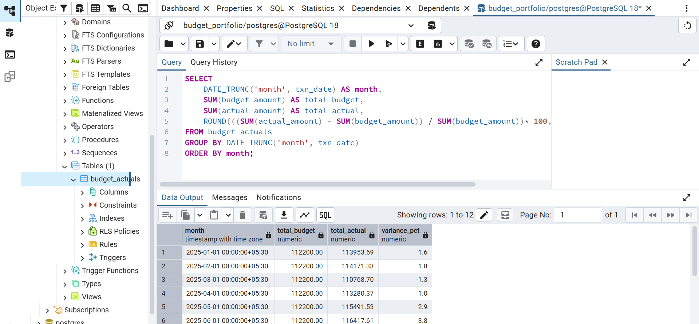
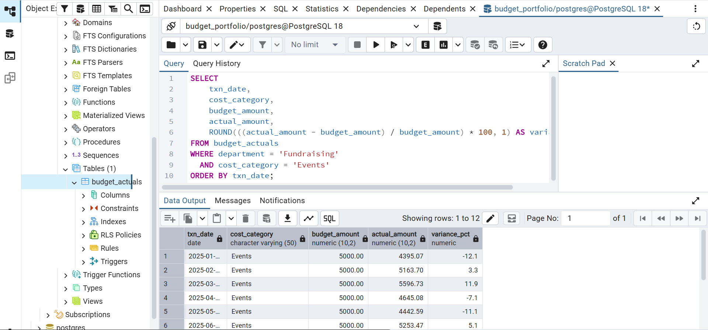

## Budget vs. Actual Variance Analysis ##
A SQL + Power BI project analyzing departmental budget performance across a full fiscal
year, built to demonstrate financial reconciliation and variance analysis skills for data analyst
roles requiring UK visa sponsorship.

## Business Question ##
Leadership wants to know: **which departments are overspending, by how much, and is
the problem constant or seasonal?** Specifically:

- Which departments/categories exceed budget by a material margin?
- Is there a recurring, predictable driver behind the biggest variances?
- How should finance prioritize where to investigate first?
  
## Tech Stack ##
- **PostgreSQL 18** — data storage and querying
- **pgAdmin 4** — database management
- **Power BI Desktop** — dashboard and visualization
- **Excel** — mock dataset construction

## Dataset ##
A mock dataset ( budget_actuals , 300 rows) modeling monthly budget vs. actual spend
across:
- **5 departments**: Marketing, Operations, IT, Programs, Fundraising
- **5 cost categories**: Salaries, Travel, Supplies, Software, Events
- **12 months** of FY2025
The data was deliberately constructed with realistic patterns rather than random noise, based on real financial reconciliation and audit experience:
- IT consistently overspends on Software (~20–35% over budget) — scope creep
- Fundraising Events spikes sharply in Nov/Dec — event season
- Programs consistently underspends on Supplies — an efficiency win
- Marketing has a one-off Travel spike in July — a conference
- Operations runs a small steady overspend on Salaries all year — overtime

## Method ##

1. **Database setup**
Created a PostgreSQL database ( budget_portfolio ) and a budget_actuals table, then imported the mock dataset via pgAdmin's Import/Export tool.

2. **SQL analysis**
Wrote six progressively deeper queries:

**Row-level variance**
```SQL
SELECT department, cost_category, txn_date, budget_amount, actual_amount, actual_amount - budget_amount AS variance
FROM budget_actuals
ORDER BY txn_date, department;
```

**Variance as a percentage**
```SQL
SELECT department, cost_category, txn_date, budget_amount, actual_amount,
       ROUND(((actual_amount - budget_amount) / budget_amount) * 100, 1) AS variance_pct
FROM budget_actuals
ORDER BY variance_pct DESC;
```

**Threshold-based flagging**
```SQL
SELECT department, cost_category, txn_date, budget_amount, actual_amount,
       ROUND(((actual_amount - budget_amount) / budget_amount) * 100, 1) AS variance_pct,
       CASE
          WHEN ABS((actual_amount - budget_amount) / budget_amount) > 0.15 THEN 'Investigate
          WHEN ABS((actual_amount - budget_amount) / budget_amount) > 0.05 THEN 'Monitor'
          ELSE 'OK'
       END AS flag
FROM budget_actuals
ORDER BY variance_pct DESC;
```

**Department-level summary**
```SQL
SELECT department,
       SUM(budget_amount) AS total_budget,
       SUM(actual_amount) AS total_actual,
       ROUND(SUM(actual_amount) - SUM(budget_amount), 2) AS total_variance,
       ROUND(((SUM(actual_amount) - SUM(budget_amount)) / SUM(budget_amount)) * 100, 1) AS va
FROM budget_actuals
GROUP BY department
ORDER BY variance_pct DESC;
```

**Month-over-month trend**
```SQL
SELECT DATE_TRUNC('month', txn_date) AS month,
       SUM(budget_amount) AS total_budget,
       SUM(actual_amount) AS total_actual,
       ROUND(((SUM(actual_amount) - SUM(budget_amount)) / SUM(budget_amount)) * 100, 1) AS variance
FROM budget_actuals
GROUP BY DATE_TRUNC('month', txn_date)
ORDER BY month;
```

**Isolated anomaly — Fundraising Events**
```SQL
SELECT txn_date, cost_category, budget_amount, actual_amount,
       ROUND(((actual_amount - budget_amount) / budget_amount) * 100, 1) AS variance_pct
FROM budget_actuals
WHERE department = 'Fundraising' AND cost_category = 'Events'
ORDER BY txn_date;
```

3. **Dashboard**
Connected Power BI directly to the live PostgreSQL database (Import mode) and built a three-part dashboard: a total variance KPI card, a color-coded bar chart by department, and a monthly trend line.

## Errors I Hit and How I Fixed Them ##

1. **Comma-formatted numbers breaking the CSV import** Excel's default number formatting rendered budget_amount as 12,000.00 with a thousands separator. PostgreSQL's NUMERIC type can't parse commas, so the import failed with:
```
ERROR: invalid input syntax for type numeric: "12,000.00"
```
**Fix**: reformatted the columns in Excel to plain numbers (no thousands separator) before re-
exporting to CSV.

2. **SQL syntax typo** Wrote budget amount instead of budget_amount (missing underscore)
in a query, producing:
```
ERROR: syntax error at or near "amount"
```
**Fix**: corrected the column reference. A small reminder that PostgreSQL's error messages point precisely to the problem — reading them literally saves time.

## Key Findings ##
- **Total YTD variance: +51.32K** over budget across all departments combined.
- **IT is the largest over spender** (+7.4%, +23.8K), driven by Software costs consistently running 20–35% over budget — a scope creep pattern rather than a one-off.
- **Operations runs a steady overspend** (+6.2%, +17.2K), mainly from Salaries — consistent with overtime costs.
- **Programs is the only department under budget** (-0.3%), thanks to disciplined Supplies spending — worth highlighting as a model for other departments.
- **Fundraising Events budget is fine most of the year but spikes hard in Nov/Dec** (+151.6% in November, +127.6% in December) — a seasonal, predictable pattern tied to event season rather than a budgeting failure. This suggests Fundraising annual budget may be reasonably sized, but its monthly allocation underestimates Q4 event costs.
- **Org-wide overspend accelerates toward year-end**, rising from roughly +1–4% in the first half of the year to a much sharper climb in November and December — indicating a seasonal cash-flow risk finance should plan capacity for, rather than a constant, evenly-distributed problem.

## Dashboard ##





## Skills Demonstrated ##
- SQL: aggregation, CASE WHEN logic, date functions, filtering, percentage calculations
- PostgreSQL setup and administration via pgAdmin
- Power BI: data modeling, DAX measures, dashboard design
- Debugging real data import and syntax errors
- Translating raw variance data into a business narrative

## Possible Extensions ##
- Add a rolling 3-month average to smooth monthly noise
- Build a what-if scenario model for Q4 event budgeting
- Add drill-through from the department chart to category-level detail
